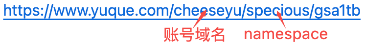

# yuque-sync
通过github actions每天定时同步语雀文章到github中

## 环境配置
由于保密性，所以设置在[Secrets](https://docs.github.com/cn/actions/reference/encrypted-secrets)中
* `YUQUE_USER_TOKEN=xxx` 语雀开发者token
* `YUQUE_LOGIN=xxx` 语雀账号域名, `eg: cheeseyu`
* `YUQUE_REPOS=xxx` 语雀知识库 namespace `,`分割, `eg: fullstack,specious`
* `GH_TOKEN=xxx` github token
* `GH_LOGIN=xxx` github 账号域名, `eg: Cheese-Yu`
* `GH_REPO=xxx` github 项目名称, `eg: blog-self`

  

## TODO
- [x] 支持上传图片到GitHub
- [ ] 支持删除文章
- [ ] 支持删除目录

## Changelog
### V1.2.0
* 支持将MarkDown文件内的图片上传到github中

### V1.1.0
* 使用知识库的名字作为文件夹目录
* 脑图文档使用图片代替
* 增加语雀原文地址
